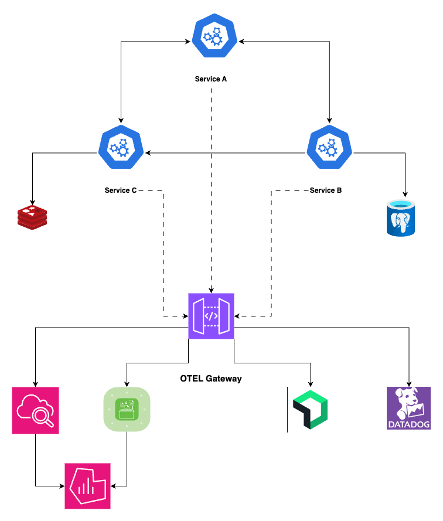

# OTEL Collector Gateway Demo

Demo Project to showcase the power of OTEL Gateway pattern.

## Motivation

OTEL Collector Gateway is a powerful construct which is not well understood and under-utilised. The goal of this project is to showcase orchestration capabilities of OTEL Gateway.

We will orchestrate different `export` strategies by just changing `OTEL Collector Configuration`, **without** doing **any code changes** or **restarting the Upstream services**.

## System Architecture

## Test Cases

**NOTE:** Logs are still experimental in OTEL, so use with caution

### No external Store

In this use case **nothing is exported** to any external store

### Enable Telemetry counting for - Service A

In this use case **only counting** is enabled for **Service A**

### Send metrics to CloudWatch - Service A

In this use case **only metrics** is exported to **CloudWatch**

### Send All telemetry to CloudWatch - Service A

In this use case all **telemetry data** is sent to **CloudWatch**

### Enable Telemetry counting for - Service B and Service C

In this use case only **counting** is enabled for **Service B and C**

### Enable metrics and traces to NewRelic for Service B

In this use case **only metrics and traces** are sent to **NewRelic** for **Service B**

### Enable High severity logs to CloudWatch for Service B

In this use case only **high severity logs** are sent to **CloudWatch Logs** for **Service B**

### Enable metrics and traces to Datadog for Service C

In this use case **only metrics and traces** are sent to **Datadog** for **Service C**

### Enable High severity logs to Datadog for Service C

In this use case only **high severity logs** are sent to **Datadog** for **Service B**

### Send normal logs to CloudWatch for Service C

In this use case all **normal logs** are sent to **Datadog** for **Service C**

## Tracing Use Cases

### Sample 100% of HTTP Errors to NewRelic - Service A

In this case it will send **100% of 5xx, 4xx errors** to **NewRelic** for **Service A**

### Sample 100% of HTTP Errors to Datadog - Service B

In this case it will send **100% of 5xx, 4xx errors** to **Datadog** for **Service B**

### Sample 100% of HTTP Errors to AWS X-Ray - Service C

In this case it will send **100% of 5xx, 4xx errors** to **AWS X-Ray** for **Service C**

### Sample 100% of HTTP Errors to AWS X-Ray - Service C

In this case it will send **100% of 5xx, 4xx errors** to **AWS X-Ray** for **Service C**

### Enable 100% sampling to NewRelic for Debugging - Service A

To investigate some recent issue, we will enable **100% sampling** for **Service A** to **NewRelic**

### Higher Latency Samples to Datadog

Sample everything that takes **more than 3000ms** to **Datadog**

